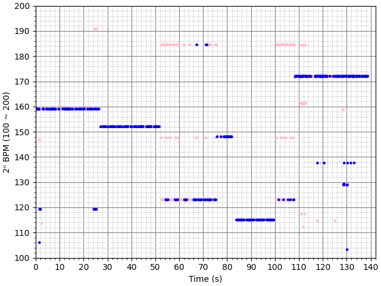

# Discord Bot (社長) for Idol Games

Support Server: [Discord](https://discord.gg/fYA3r8tens)

This repository currently contains only the parts that have been tidied up and do not include codes that connect to the API servers.

Currently there are also wrappers that simulates discord interactions on Guilded and Telegram. Some caveats:
- Guilded currently does not open the file API to bots.
- Guilded does not have any command system.
- Telegram uses a different set of formatting codes, which may not be fully supported as of now
- Telegram does not support embed, so only a simulated one is served.
- Telegram does not have native mechanisms regarding dropdowns.
- Telegram does not have native mechanisms regarding subcommands.

## Some points on usages:

- On platform that only allows alphabetical names, this bot may be named "Tsukasa Kiryu". (The name of the character in the bot's thumbnail.)
- Notice that text commands are supported by the default prefix `mb#` (the original name "Misc Bot") or by tagging the bot before the command.
  - Therefore `mb#help` can be used like `/help` to display the command list.
- If the bot has access to messages in the channel:
  - The public guess for guessing games can be done simply by replying to the "question" with your answer.
  - Messages can be deleted by the caller via the ❌ emoji.
- Due to Discord's cache mechanism, the "Question Audio/Image" link in guessing games only remain available when the bot can access the channel (so that the question can be backed up completely).
- Commands like card / song / poster / ... usually also accepts internal ID as the input (that you may find from the result from searching commands or embed footers).
- If you see "This command is outdated, please try again in a few minutes" when triggering a command, this usually means the command has been updated but not yet reflected on the client side. You may try restarting or force reloading (Ctrl/Cmd+R) the app to have the changes reflected immediately.


## Error reports:

If some commands trigger an error message that should not be there, errors will be sent to a channel that will be reviewed and fixed as soon as possible. Therefore, generally there are no needs to report errors. If errors are not fixed in a few days, feel free to submit an issue regarding those errors.

- Errors refer to those red embeds with content as `No Information Available.`
- If the content is not `No Information Available.`, the error should already be handled properly.
  - Exceptions like `DataUnavailableException` or `AssetNotExistException` really means that the requested information does not exist.
  - Error handling can still be bugged that prevents the whole command from working. If that is the case, feel free to raise an issue. 

## User contribution:

Users can currently submit changes under the below categories via pull requests. They will be reviewed and add to the bot if approved as soon as possible. The contributors will be shown in the credit section on [twy.name](https://twy.name/contribution/) and bot commands.

- [Game Support](#game-support)
- [Song Aliases](#song-aliases)
- [Song BPM](#song-bpm)
- [Translation](#translation)

### Game Support:

Some classes are already created to wrap data from multiple games with a common structure that makes code/function reusing much easier. Here is a list of the implemented classes. They will be released under `common/` when the refactoring is complete:

After that users should be able to add support to other games by implementing subclasses of such classes that takes in game data and uses the common interfaces to handle data retrievals.

- Notice that it should not rely on third-party maintained database even for version checking. If the game API is needed, contributes the hosting script that makes it work.

Game related:
- asset_list.py (Handle different asset list / manifest format)
- character.py (Very Basic Character Information like first names and last names)
- chart_factory.py (The common chart format that contains note info and chart drawing in a shared interface, with plans to chart video support migrated here)
- chart_utility.py (Sophisticated Tools like fourier transform and techniques like Eighth note tick investigation and note distance check, in order to determine BPMs automatically for games that don't provide so in their charts)
  - Difficult cases may be hard-coded in the corr. game directory those.
- event.py (Event Information like Start / End Time of each event)
- masterdata.py (A class that stores the current data of the game and allow retrievals by table name)
- song.py (Containing classes and most logics that handle song data (pronunciation / song jacket / characters / composer / lyrics / etc.), song track data (vocal / instrumental), song difficulty data (note count / charts))
- stamp.py (Containing stamp data with character names and stamp names so it can be used to serve stamps)

API Related:
- player.py (a class with Player ID / Name / Label / etc. used especially in ranking display)
- ranking.py (Contain the class to handle converted results of game rankings, and different finders to send minimal requests to obtain nearby ranks or borders for games with different ranking API types)
  - Especially for games that allows ranking pagination or range queries
  - Also contain classes to save or read event ranking history.
- ranking_chart.py (Allow taking in a ranking history list and shows the ranking trend chart image.)
- ranking_predict.py (Allow taking multiple ranking history lists and uses simple math from similar events to predict the final result.)

Utilities:
- file_cache.py (Custom memoization class that remembers the results of frequently called functions in the current game version)
- game_common.py (Handle the way to send multiple files from asset/media extractions)
- get_apk.py (A script trying to download the apk to obtain essential info like app hash to keep API running whenever it requires an app version update)
- git_handler.py (Syncing master data to Github automatically upon download)
- graphics.py (Containing a PIL.ImageDraw subclass that draws anti-aliased polygons instead)
- rate_limiter.py (Tools to prevent rapid message edits resulting in Bot Platform 429 response code)
- zip_handler.py (Easily create zip files to be sent to the specified platform channels)

Bot related:
- [command_text.py](common/command_text.py) (All those texts used in command description or fields)
- [exception.py](common/exception.py) (All those common exception to be raised for different cases)
- [glossary.py](common/glossary.py) (Pre-translated vocabularies to be used in bot outputs)
- guess.py (Handle all classes and modals responsible for the flow of the guessing game)
- profile_view.py (Handle the drop down box from ranking commands that allow picking players to show extra information like player profile, mission clear details, best units, or etc.)
- story_viewer.py (All logics regarding the story viewer that allows users to view story by choosing the category, subcategory, and then the specified entry to view)

Deprecating:
- suggest_match.py (A class for fuzzy matching and autocomplete, expected to be replaced by the tailor-made matching mechanisms for each of the classes like character, song, asset name, etc. for their own use cases)
- suggest_match_enum.py (Matching mode for suggest_match.py)

Planned to be added:
- card.py (Basic "card" class with tags for serving card / poster / accessory information)
- gacha.py (Logics regarding the "spark" characters / probability rates / gacha description / etc.)

### Song Aliases:

Currently the bot does not maintain a user-submitted song/character alias list.

You may contribute to the file `song_alias_list.py` if a name is an unlisted officially translated title or titles with all the Katakana replaced with the borrowed term (in English or the source language) that is significantly different from the Romaji that makes the bot underestimate the name similarity.

- PJSK ([song_alias_list.py](pjsk/song_alias_list.py))
- WDS ([song_alias_list.py](wds/song_alias_list.py))

### Song BPM:

The following games have special status regarding BPM information in their chart files:

- CGSS
  - Only the overall BPM is stated.
    - Problem may arise if the BPM changes throughout the song.
- PJSK
  - The chart provides full BPM Info.
  - However, they forcefully set all measures to be 4/4, even for 3/4 songs like `去り人達のワルツ`.
- WDS ([song_chart_known_bpm.py](wds/song_chart_known_bpm.py), [Current Result (Read-only)](https://github.com/t-wy/game-public-data/blob/main/wds/song_bpm.json))
  - The distance between ticks are eighth notes by default. Make sure the BPMs match so.
  - The "Chart BPM Debug" under the song difficulty menu displays the corresponding BPM that may facilitate BPM finding. (The auto BPM-finder also bases on that result.)
  - The following chart is from the song `Stellarium Collection Vol.1`:
    - The extracted BPM sequence is then 159→152→123→148→115→123→172.
    
    - The following auto-generated values are used in generating the chart:
      ```py
      [
        (BPM(bpm=159.0, time=0.0), (4, 4)),
        (BPM(bpm=152.0, time=27.169811320754718), (4, 4)),
        (BPM(bpm=123.0, time=52.43296921549156), (4, 4)),
        (BPM(bpm=148.0, time=75.84760336183302), (4, 4)),
        (BPM(bpm=115.0, time=83.95571146994114), (4, 4)),
        (BPM(bpm=123.0, time=100.65136364385418), (4, 4)),
        (BPM(bpm=172.0, time=108.45624169263468), (4, 4))
      ]
      ```
    - Pink ones are based on the note distances, while the blue ones are based on Eighth Notes.
- SFP ([song_chart_known_bpm.py](sfp/song_chart_known_bpm.py), [Current Result (Read-only)](https://github.com/t-wy/game-public-data/blob/main/sfp/song_bpm.json))
  - The case is similar to WDS.
  - The "Chart BPM Debug" under the song difficulty menu displays the corresponding BPM that may facilitate BPM finding. (The auto BPM-finder also bases on that result.)
  - However, they tend to use far less sliders (NoteLines) and thus less Eighth Ticks are availble in the charts.
  - Therefore, expect some 0.5x, 1.5x and 2x BPM to be manually fixed.
- etc.

Feel free to edit the corresponding `song_chart_known_bpm.py` file (not `song_chart_known_bpm_generated.py`) when the auto-generated result differs from the actual BPM / time signature.
- `song_chart_known_bpm_generated.py` is only generated for quick public reference. It is not used in the actual bot in any way.

### Translation:

Users can submit translations of available files via pull requests. If other translations are incorrect or inappropriate, please submit an issue.

- Common
  - [command_text.py](common/command_text.py)
  - [exception.py](common/exception.py)
  - [glossary.py](common/glossary.py)
- WDS
  - [translator.py](wds/translator.py)

Notice that the language of translation is based on the locale of the discord User, followed by the guild locale (default to en_US by Discord, but **is ignored** if the guild is not discoverable).

Both full locale (e.g. ja, en-US, zh-TW) and short locale (e.g. ja, en, zh) can be used to specify the translation. "-" should be replaced by "_" when specifying keys or arguments. The priorities for locales with subtags is demostrated below:

- `ja`: `ja` → remain unchanged
- `en-US`: `en_US` → `en` → remain unchanged
- `zh-TW`: `zh_TW` → `zh` → remain unchanged

All languages supported by Discord are listed below [Link](https://discord.com/developers/docs/reference#locales):

Notice that aforementioned telegram support may use another set of locales, which are to be mapped to this list as many as possible.

| LOCALE | LANGUAGE NAME         | NATIVE NAME         | Priority 1 | Priority 2 |
|--------|-----------------------|---------------------|------------|------------|
| id     | Indonesian            | Bahasa Indonesia    | id         |            |
| da     | Danish                | Dansk               | da         |            |
| de     | German                | Deutsch             | de         |            |
| en-GB  | English, UK           | English, UK         | en_GB      | en         |
| en-US  | English, US           | English, US         | en_US      | en         |
| es-ES  | Spanish               | Español             | es_ES      | es         |
| fr     | French                | Français            | fr         |            |
| hr     | Croatian              | Hrvatski            | hr         |            |
| it     | Italian               | Italiano            | it         |            |
| lt     | Lithuanian            | Lietuviškai         | lt         |            |
| hu     | Hungarian             | Magyar              | hu         |            |
| nl     | Dutch                 | Nederlands          | nl         |            |
| no     | Norwegian             | Norsk               | no         |            |
| pl     | Polish                | Polski              | pl         |            |
| pt-BR  | Portuguese, Brazilian | Português do Brasil | pt_BR      | pt         |
| ro     | Romanian, Romania     | Română              | ro         |            |
| fi     | Finnish               | Suomi               | fi         |            |
| sv-SE  | Swedish               | Svenska             | sv_SE      | sv         |
| vi     | Vietnamese            | Tiếng Việt          | vi         |            |
| tr     | Turkish               | Türkçe              | tr         |            |
| cs     | Czech                 | Čeština             | cs         |            |
| el     | Greek                 | Ελληνικά            | el         |            |
| bg     | Bulgarian             | български           | bg         |            |
| ru     | Russian               | Pусский             | ru         |            |
| uk     | Ukrainian             | Українська          | uk         |            |
| hi     | Hindi                 | हिन्दी               | hi         |            |
| th     | Thai                  | ไทย                 | th         |            |
| zh-CN  | Chinese, China        | 中文                | zh_CN      | zh         |
| ja     | Japanese              | 日本語              | ja         |            |
| zh-TW  | Chinese, Taiwan       | 繁體中文            | zh_TW      | zh         |
| ko     | Korean                | 한국어              | ko         |            |

(You may include other translations, but they cannot be reflected on the bot until it is supported by Discord)
